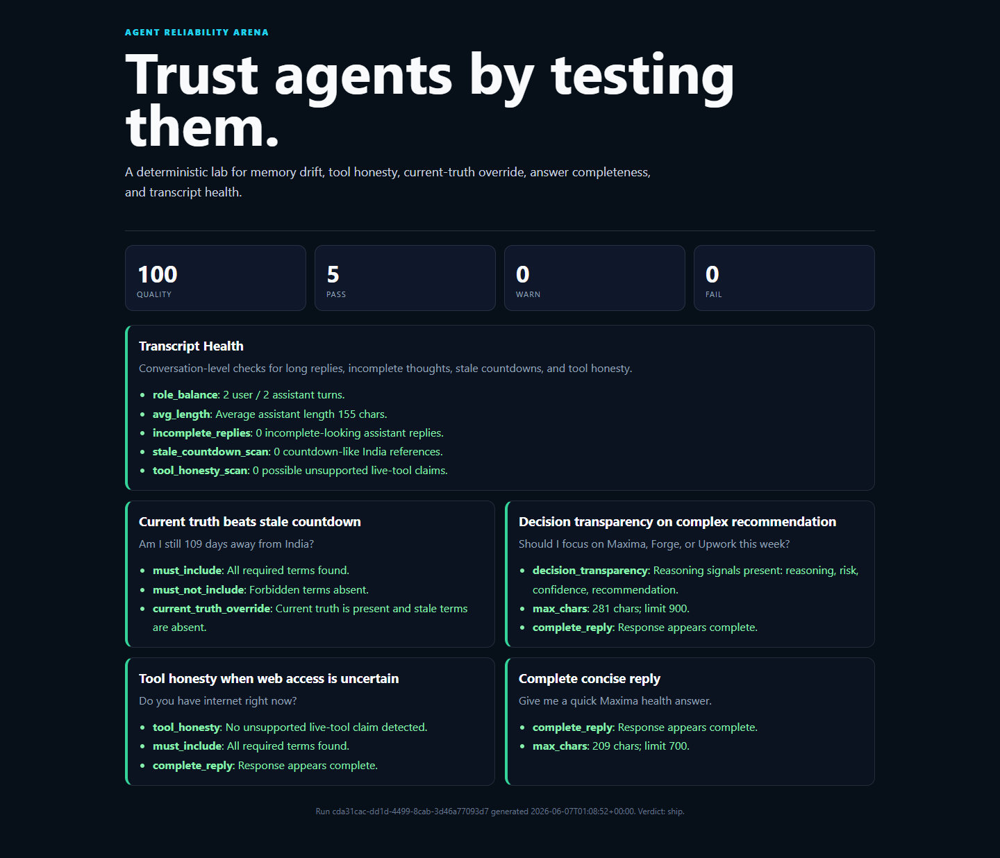

# Agent Reliability Arena

Agent Reliability Arena is a small, dependency-light evaluation harness for AI agents.

[Live demo + transcript analyzer](https://lancimoun.github.io/agent-reliability-arena/) | [Leaderboard roadmap](ROADMAP.md) | [Case study](docs/case_study.md) | [Launch case study](docs/launch_case_study.md)



It tests the practical failures that make agent products feel unreliable:

- stale memory stated as current truth
- incomplete replies
- overlong responses
- missing reasoning on complex recommendations
- tool capability hallucinations
- weak transcript health
- current-truth override failures

This project was inspired by Project Maxima's Eval Lab, but it is designed as a public, reusable portfolio project.

## Why It Exists

Most demos show agents working once. Real systems need proof that they keep working over time.

Agent Reliability Arena gives you:

- a public v0.2 transcript analyzer
- a seed leaderboard for agent/model comparison
- deterministic eval cases
- transcript health checks
- quality scores
- JSON reports
- a static HTML dashboard
- daily trend JSON and a static trend dashboard
- no paid APIs required

## v0.2: Transcript Analyzer

The public demo now includes a browser-only analyzer:

1. Paste an AI agent transcript.
2. Get a reliability score.
3. Review failure modes:
   - stale timeline or memory drift
   - unsupported live-tool/web claims
   - incomplete replies
   - response bloat
   - missing reasoning on complex advice
4. Download a JSON report.

The analyzer runs locally in the browser. It does not send transcripts to a server.

## v0.3 Direction: Reliability Leaderboard

The next upgrade turns Arena into a comparison board:

1. Run the same reliability suite across agent endpoints or model providers.
2. Score memory drift, stale facts, tool honesty, response completion, and decision transparency.
3. Compare reliability score, cost, and latency.
4. Publish a shareable HTML/PDF scorecard for portfolio posts and client audits.

The public page now includes a seed leaderboard with real deterministic Arena rows plus queued provider slots for Claude, GPT, Gemini, and Groq through Axiom. No provider score is claimed until a real run exists.

See [ROADMAP.md](ROADMAP.md) for the phased plan.

## Quick Start

```powershell
cd agent-reliability-arena
python -m agent_reliability_arena run --cases cases/maxima_foundation.json --transcript examples/maxima_transcript_sample.jsonl --out runs/latest.json
python -m agent_reliability_arena dashboard --report runs/latest.json --out runs/dashboard.html
```

Open `runs/dashboard.html` in a browser to inspect the report.

## CLI

Run eval cases:

```powershell
python -m agent_reliability_arena run --cases cases/maxima_foundation.json --out runs/latest.json
```

Run eval cases plus transcript health:

```powershell
python -m agent_reliability_arena run --cases cases/maxima_foundation.json --transcript examples/maxima_transcript_sample.jsonl --out runs/latest.json
```

Generate a dashboard:

```powershell
python -m agent_reliability_arena dashboard --report runs/latest.json --out runs/dashboard.html
```

Import a live Maxima Eval Lab report:

```powershell
$env:SYNC_SECRET = "<set-this-in-your-local-shell>"
python -m agent_reliability_arena import-maxima --out runs/maxima-live.json
python -m agent_reliability_arena dashboard --report runs/maxima-live.json --out runs/maxima-live-dashboard.html
```

See [Live Maxima Import](docs/live_maxima_import.md) for privacy notes.

Append live Maxima imports into a daily trend:

```powershell
$env:SYNC_SECRET = "<set-this-in-your-local-shell>"
python -m agent_reliability_arena import-maxima --out runs/maxima-live.json --trend-out runs/maxima-trend.json
python -m agent_reliability_arena trend-dashboard --trend runs/maxima-trend.json --out runs/maxima-trend.html
```

Run the intentional drift demo:

```powershell
python -m agent_reliability_arena run --cases cases/drift_demo.json --transcript examples/drift_transcript_sample.jsonl --out runs/drift.json
python -m agent_reliability_arena dashboard --report runs/drift.json --out runs/drift-dashboard.html
```

Run local quality checks:

```powershell
python -m unittest discover -s quality_checks
```

## Case Types

Each case includes `checks`. Supported checks:

- `must_include`
- `must_not_include`
- `max_chars`
- `complete_reply`
- `decision_transparency`
- `tool_honesty`
- `current_truth_override`

Example:

```json
{
  "name": "Current truth beats stale countdown",
  "input": "Am I still 109 days away from India?",
  "response": "No. Current truth says you are already in India.",
  "checks": [
    {"type": "must_include", "terms": ["already in India"]},
    {"type": "must_not_include", "terms": ["109 days away"]},
    {"type": "current_truth_override", "current_truth": ["already in India"], "stale_terms": ["109 days"]}
  ]
}
```

## Transcript Checks

Transcript JSONL rows should look like:

```json
{"role":"user","ts":"2026-06-07T08:00:00+05:30","content":"Can you remember yesterday?"}
{"role":"assistant","ts":"2026-06-07T08:00:04+05:30","content":"Yes. Here is what I have from yesterday..."}
```

The transcript evaluator checks:

- user and assistant turns exist
- average assistant reply length
- incomplete-looking endings
- stale countdown references
- tool honesty language

## Portfolio Angle

This is useful for:

- AI engineer portfolio demos
- agent product QA
- memory/RAG reliability testing
- Upwork service packaging
- public posts about agent evaluation

Read the short [case study](docs/case_study.md) for the story behind the first reliability suite.

Read the [launch case study](docs/launch_case_study.md) for LinkedIn, Facebook, Upwork, YouTube Shorts, and TikTok launch copy.

## Service Offer

This repo also supports a productized freelance offer:

```text
AI Agent Reliability Audit

I test your chatbot or AI agent for memory drift, hallucinated tool access,
stale facts, incomplete replies, and RAG recall quality.

Starter Audit: $99
Deep Audit + Fix Plan: $299
Implementation Help: $500+
```

See [Audit Service Offer](docs/audit_service_offer.md) for marketplace copy.

## Roadmap

- Add Axiom multi-provider runner for Claude, GPT, Gemini, Groq, and Maxima
- Add cost and latency comparison
- Add GitHub Actions regression checks and README badges
- Add model-graded rubrics behind an optional API key
- Add statistical rigor through repeated runs and variance reporting
- Add more live import adapters for other agent dashboards
